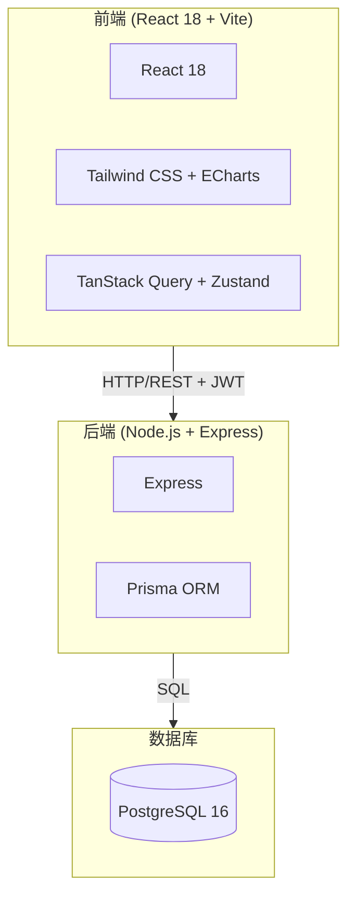

```markdown
# 教师数字画像系统 - 项目规格说明书

## 1. 系统概述
教师数字画像系统是一个面向高校的教师综合能力评估与可视化平台。
系统通过采集教师的教学、科研、社会服务等多维度数据，构建教师个人画像，
为教师发展、考核评价、人才选拔提供数据支撑。

## 2. 功能模块

### 2.1 用户认证模块
- 教师/管理员登录（JWT Token）
- 角色权限控制（TEACHER/ADMIN/SUPER_ADMIN）

### 2.2 教师画像模块
- 个人基础信息展示
- 能力雷达图（教学/科研/服务/协作/创新）
- 标签体系（教学名师、科研骨干等）
- 综合评分计算

### 2.3 数据管理模块
- 教师信息管理（CRUD）
- 课程信息管理
- 评价记录管理
- 科研成果管理

### 2.4 可视化分析模块
- 仪表盘统计
- 学院分布图表
- 职称分布图表
- 趋势分析

### 2.5 系统管理模块
- 用户管理
- 日志审计
- 数据备份

## 3. 技术架构



## 4. 数据库设计

详见 `apps/api/prisma/schema.prisma`

## 5. API 设计规范

### 响应格式

```json
{
  "success": true,
  "data": {},
  "message": "操作成功"
}
```

### 错误格式

```json
{
  "success": false,
  "message": "错误描述"
}
```

### 认证方式

```
Header: Authorization: Bearer <token>
```

---

## 🚀 快速开始指南

### 方式一：Docker 一键启动（推荐）

```bash
# 1. 克隆项目
git clone <your-repo> teacher-digital-profile
cd teacher-digital-profile

# 2. 启动所有服务
docker-compose up -d

# 3. 初始化数据库
docker-compose exec api npx prisma migrate dev --name init
docker-compose exec api npx prisma db seed

# 4. 访问系统
# 前端: http://localhost:5173
# 后端 API: http://localhost:3001
# Prisma Studio: docker-compose exec api npx prisma studio
```

### 方式二：本地开发

```bash
# 1. 安装依赖
npm install

# 2. 启动 PostgreSQL 和 Redis（需本地安装或使用 Docker）
docker run -d --name tdp-postgres -e POSTGRES_PASSWORD=tdp_password -e POSTGRES_DB=teacher_profile -p 5432:5432 postgres:16-alpine

# 3. 配置环境变量
cp apps/api/.env.example apps/api/.env
# 编辑 .env 文件设置数据库连接

# 4. 初始化数据库
cd apps/api
npx prisma migrate dev --name init
npx prisma db seed

# 5. 启动开发服务器
# 终端1：启动 API
npm run dev --workspace=@tdp/api

# 终端2：启动 Web
npm run dev --workspace=@tdp/web
```
